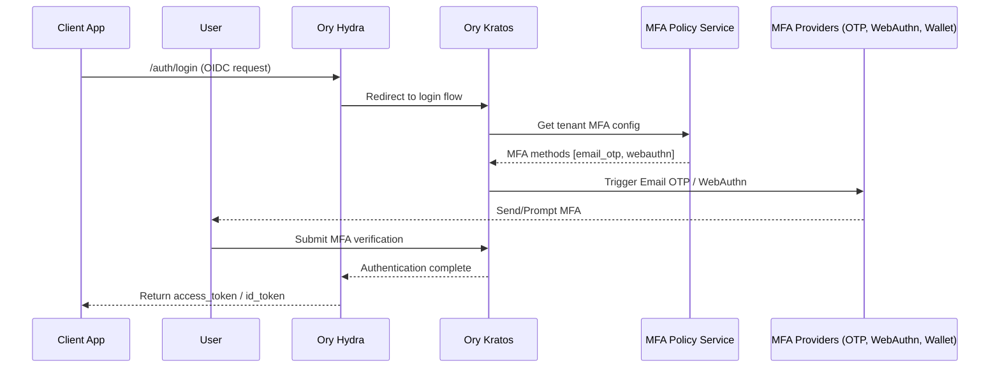
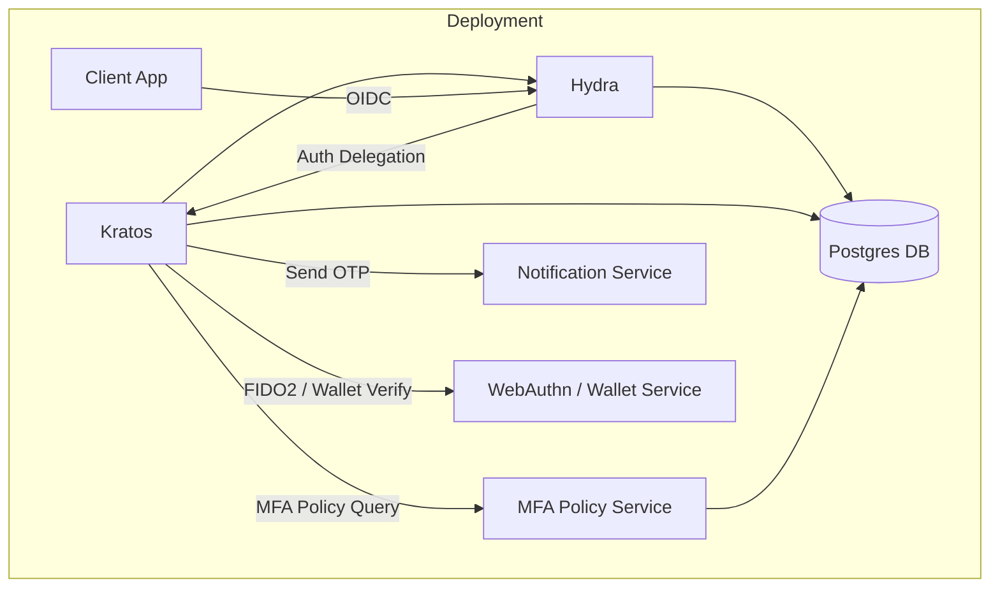

# 🛡️ MFA as a Service — Multi-Tenant Architecture

## Overview

**MFA-as-a-Service** provides secure, flexible, and multi-tenant authentication & verification for external applications.  
Each client (tenant) can register, choose desired MFA mechanisms, and enforce them for their users — powered by **Ory Kratos** for identity, **Ory Hydra** for OAuth2/OIDC, and optional components for notifications and wallet verification.

---

## 🧱 Core Components

| Component | Description |
|------------|--------------|
| **Ory Kratos** | Identity and MFA engine managing users, sessions, and WebAuthn. |
| **Ory Hydra** | OAuth2/OIDC provider issuing tokens post-authentication. |
| **MFA Policy Service** | Custom service storing and enforcing per-tenant MFA configurations. |
| **Notification Service** | Sends Email/SMS OTPs using pluggable providers (SES, Twilio, etc). |
| **Wallet Verifier** | Handles wallet-based authentication (e.g., SIWE / ECDSA signatures). |

---

## 🧩 Multi-Tenant Model

### Entities

#### 1. Tenant (Client Application)
Represents an application integrating with the MFA service.

| Field | Type | Description |
|--------|------|-------------|
| `id` | UUID | Unique identifier for tenant |
| `name` | string | Display name |
| `client_id` | string | OAuth2 client ID |
| `client_secret` | string | OAuth2 client secret |
| `redirect_uris` | array | Allowed redirect URLs |
| `allowed_mfa_methods` | array | Selected MFA types (e.g. `["email_otp", "webauthn"]`) |

#### 2. User
Represents an end-user authenticated through the tenant.

| Field | Type | Description |
|--------|------|-------------|
| `id` | UUID | Unique identifier |
| `tenant_id` | UUID | Linked tenant |
| `email` | string | Email for OTP or WebAuthn |
| `phone` | string | Phone number for SMS OTP |
| `mfa_enrolled` | array | Enrolled factors (e.g., `["totp", "webauthn"]`) |
| `public_key` | string (optional) | Wallet / WebAuthn public key |

---

## ⚙️ API Design

### Tenant Management

#### `POST /api/tenants/register`
Registers a new client (tenant) application.

**Request**
```json
{
  "name": "Reward Portal",
  "redirect_uris": ["https://reward.app/auth/callback"],
  "allowed_mfa_methods": ["email_otp", "webauthn"]
}
```

**Response**
```json
{
  "tenant_id": "123e4567-e89b-12d3-a456-426614174000",
  "client_id": "reward_app",
  "client_secret": "s3cr3t",
  "issuer": "https://mfa-service.com"
}
```

---

### User Authentication Flow

#### Step 1 — Redirect to Login
```http
GET /auth/login?client_id={CLIENT_ID}&redirect_uri={CALLBACK_URL}
```

The user is redirected to Ory Hydra → Ory Kratos for login.

#### Step 2 — MFA Determination
Kratos queries **MFA Policy Service**:
```json
{
  "tenant_id": "123e4567",
  "user_id": "user-789"
}
```
Response:
```json
{
  "required_mfa": ["email_otp", "webauthn"]
}
```

#### Step 3 — Execute MFA
Depending on the tenant configuration:

| Type | Flow | Verification |
|------|------|---------------|
| **Email OTP** | Send via SES | `/mfa/email/verify` |
| **SMS OTP** | Send via Twilio | `/mfa/sms/verify` |
| **TOTP** | Google Authenticator | `/mfa/totp/verify` |
| **WebAuthn** | FIDO2 browser prompt | `/mfa/webauthn/verify` |
| **Wallet Verification** | SIWE / ECDSA | `/mfa/wallet/verify` |

#### Step 4 — Issue Token
On success, Hydra issues:
```json
{
  "access_token": "jwt-token",
  "id_token": "oidc-id-token",
  "expires_in": 3600
}
```

---

## 🔐 MFA Policy Service (Custom Component)

Responsible for:
- Storing MFA preferences per tenant
- Validating which MFA mechanisms are required
- Integrating with Ory Kratos flows

**Endpoints**
```http
POST /api/policy
GET  /api/policy/{tenant_id}
```

**Example Policy**
```json
{
  "tenant_id": "tenant-123",
  "mfa_methods": ["email_otp", "webauthn"],
  "enforcement_mode": "strict"
}
```

---

## 🧬 Sequence Diagram



---

## 🪙 Example MFA Verification APIs

### Email OTP
**POST /mfa/email/send**
```json
{ "email": "user@example.com" }
```

**POST /mfa/email/verify**
```json
{ "email": "user@example.com", "otp": "123456" }
```

### WebAuthn
**POST /mfa/webauthn/attestation**
```json
{ "challenge": "...", "publicKey": "..." }
```

### Wallet Verification (SIWE)
**POST /mfa/wallet/verify**
```json
{
  "address": "0x123...",
  "signature": "0xabc...",
  "message": "Sign-in request"
}
```

---

## 🧠 Extensibility

You can add new MFA providers by implementing the interface:

```go
type MFAProvider interface {
    Init(ctx context.Context, tenant Tenant) error
    Enroll(ctx context.Context, user User) error
    Verify(ctx context.Context, user User, data any) error
}
```

---

## 🧰 Deployment Architecture



---

## 🔒 Security Considerations
- Use **OIDC Dynamic Client Registration** for tenant onboarding.
- Secure inter-service calls with **mTLS or OAuth2 service tokens**.
- Encrypt MFA secrets and OTP seeds using KMS.
- Log and monitor failed MFA attempts per tenant.

---

## 🚀 Summary

| Capability | Supported By |
|-------------|---------------|
| Multi-Tenant Isolation | Custom MFA Policy Service |
| Passwordless Login | Ory Kratos |
| OAuth2 / OIDC | Ory Hydra |
| TOTP / Email / SMS | Custom MFA adapters |
| WebAuthn / FIDO2 | Native in Kratos |
| Wallet (ECDSA/SIWE) | Custom verifier |
| Scalability | Stateless API + shared DB |
| Extensibility | Plug-and-play MFA providers |
